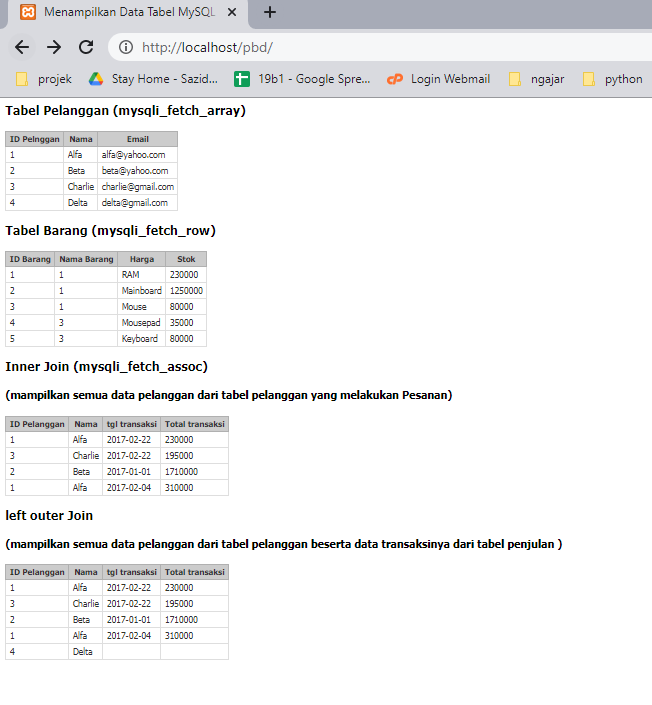

# Menampilkn-join-tabel
Langkah2  

1. buat tabel pelanggan
2. buat tabel barang
3. buat tavel penjulan
4. buat tabel penjualan detail
5. buat koneksi  di konkesi.php
6. buat halaman index di index.php

# Tampilan desain database (CDM / PDM / ERD)

# tampilan index

